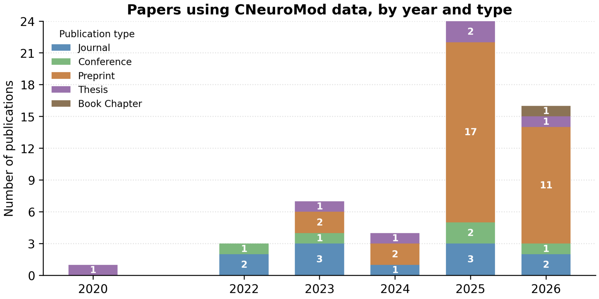

# CNeuroMod reuse statistics



How much is the [Courtois NeuroMod](https://www.cneuromod.ca/) (CNeuroMod) dataset reused? This project counts the papers that use CNeuroMod data, by year and publication type (journal article, preprint, conference paper, thesis, book chapter), from the curated reference list maintained in [`cneuromod.all`](https://github.com/courtois-neuromod/cneuromod.all).

Built on the [`invoke`](https://www.pyinvoke.org/) task runner and [`airoh`](https://pypi.org/project/airoh/), from the [airoh-mini template](https://github.com/airoh-pipeline/airoh-template).

---

## Quick Start

```bash
uv sync
uv run invoke fetch
uv run invoke run
```

---

## Setup

```bash
uv sync
```

This creates a `.venv` and installs every dependency from `pyproject.toml`, including a recent `git-annex` (needed to retrieve annexed files from `cneuromod.all`). [Inkscape](https://inkscape.org/) is optional: it is only used by `compose-figure` to render the final montage, and a missing binary is skipped with a warning.

---

## Fetch the source data

```bash
invoke fetch                                   # datalad clone cneuromod.all, get the reference list
invoke fetch --cneuromod-source ../cneuromod.all   # or: symlink a checkout you already have
```

`cneuromod.all` is both a source (its reference list is read here) and a future write target (new publications get added back to it), so it is never copied. It is either a fresh clone or a symlink to your own checkout. Only the reference files are retrieved, not the imaging data. To re-point a stale symlink, run `invoke clean-cneuromod` first. That task removes a symlink but never a real clone, which may contain unpushed work.

---

## Run the pipeline

```bash
invoke run            # citations → figure layout → notebook → montage
invoke run --force    # clean every computed output first, then run from scratch
```

Steps whose output already exists are skipped. Caching is by existence, not content: **a step you just edited will still be skipped**. Use `invoke clean-{name}` to redo one step, or `invoke run --force` to redo everything.

`invoke run-smoke` makes a fast end-to-end pass on a handful of references. It removes computed outputs before and after, so its partial results are never mistaken for real ones. Run `invoke run` afterwards to get the real outputs back.

`invoke run` also writes `output_data/PROVENANCE.json` (git commit, environment, inputs consumed, a checksum per output).

---

## Curate the reference list

New papers using CNeuroMod data are found and added back to `cneuromod.all` through a pull request. This is a conversation between you and Claude, not part of `invoke run`: it needs the network and ends by pushing a branch.

```bash
invoke lit-search                 # Europe PMC, OpenAlex, arXiv since the last SearchDate
invoke lit-status                 # candidates awaiting a decision, with draft BibTeX
invoke lit-decide --id ID --decision accept --reason "uses the Friends data"
invoke lit-propose --dry-run      # preview the bib diff and PR body
invoke lit-propose                # push a branch and open the PR on cneuromod.all
```

Claude also runs web searches and registers hits with `lit-candidate`; the `literature-search` skill describes the whole session. Every search and decision is logged in [`literature_search/`](literature_search/README.md), which you commit like code. `lit-propose` works in a temporary git worktree, so your own `cneuromod.all` checkout keeps its branch and files.

---

## Check that everything still agrees

```bash
uv run pytest         # unit tests for analysis/
invoke verify         # code, config, data and docs still describe the same project
```

Run both before committing. `verify` is deliberately not part of `invoke run`.

---

## Design principles

- **Analysis in code, visualization in notebooks.** BibTeX parsing and classification live in `analysis/citations.py`, run by `run-citations`. The notebook only reads the CSV and draws.
- **Idempotent steps.** Each `run-{name}` task skips if its outputs exist. `--force` rebuilds.
- **Mirrored clean tasks.** Every `run-{name}` has a matching `clean-{name}`, and the top-level `clean` calls them all.
- **Gathering is separate from reproducing.** `fetch` retrieves, and `run` never pulls. If the reference list is missing, `run-citations` stops and points at `invoke fetch`.
- **Hand-authored montage, single source of truth for layout.** `output_data/figure_montage.svg` places each notebook panel. The notebook renders each panel at exactly its placed size. See `CLAUDE.md`, "Figures: the Inkscape montage pattern".

---

## Task Overview

| Task                | Description                                              |
| ------------------- | -------------------------------------------------------- |
| `fetch`             | Gets all source data; routes `--cneuromod-source` to `fetch-cneuromod` |
| `fetch-cneuromod`   | Clones (or symlinks via `--source`) cneuromod.all and retrieves its reference list |
| `run`               | Runs the full pipeline in order; `--force` cleans first  |
| `run-citations`     | Counts papers using CNeuroMod data by year and type → `cneuromod_citations.csv` |
| `run-figure-layout` | Writes the montage's panel geometry to `output_data/figures/panel_sizes.json`; always re-runs |
| `run-notebooks`     | Executes notebooks and saves figures to `output_data/figures/` |
| `compose-figure`    | Renders `figure_montage.svg` to PNG with Inkscape (optional binary) |
| `run-smoke`         | Fast end-to-end pass on a few references; cleans outputs before and after |
| `lit-search`        | Searches Europe PMC, OpenAlex and arXiv for new CNeuroMod papers; logs a session in `literature_search/` |
| `lit-candidate`     | Registers a paper found by web search as a candidate     |
| `lit-status`        | Prints candidates awaiting a decision, with draft BibTeX |
| `lit-decide`        | Records an accept / reject / defer decision in `decisions.jsonl` |
| `lit-propose`       | Opens a PR on cneuromod.all adding the accepted papers; `--dry-run` previews |
| `verify`            | Checks that code, config, data and docs still agree      |
| `clean`             | Removes all computed outputs                             |
| `clean-citations`   | Removes `cneuromod_citations.csv`                        |
| `clean-figures`     | Removes the figures dir (panels, notebook sentinels, panel_sizes.json) |
| `clean-figure`      | Removes the composed montage PNG (never the hand-authored SVG) |
| `clean-lit-search`  | Removes one dated session folder of `literature_search/` (never `decisions.jsonl`) |
| `clean-source`      | Removes all source data assets; routes to each `clean-{name}` |
| `clean-cneuromod`   | Removes the cneuromod.all symlink (never a real clone)   |

Use `invoke --list` or `invoke --help <task>` for details.

---

## Data

- **Source data**: see [`source_data/CONTENT.md`](source_data/CONTENT.md)
- **Output data**: see [`output_data/CONTENT.md`](output_data/CONTENT.md)

---

## Folder Structure

| Folder / File  | Description                              |
| -------------- | ---------------------------------------- |
| `analysis/`    | Pure Python analysis logic, called by invoke tasks |
| `notebooks/`   | Jupyter notebooks for visualization (one per figure) |
| `literature_search/` | Log of literature searches and curation decisions — see [`literature_search/README.md`](literature_search/README.md) |
| `tests/`       | Unit tests for `analysis/` (pytest)      |
| `source_data/` | Inputs — see [`source_data/CONTENT.md`](source_data/CONTENT.md) |
| `output_data/` | Generated results and figures — see [`output_data/CONTENT.md`](output_data/CONTENT.md) |
| `tasks.py`     | Project-specific invoke tasks            |
| `invoke.yaml`  | Config: paths, datasets, figures, verify settings |

---

### Uncle Airoh

When working in this project, Claude Code responds as **Uncle Airoh**: patient, warm, and wise — and a calming cup of jasmine tea is always on offer.
